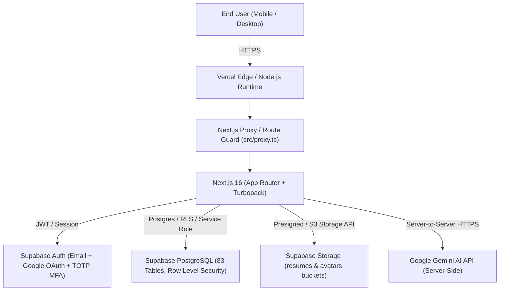

# ExamNova — Production Readiness Checklist & Deployment Status

## 1. System Architecture Overview

---

## 2. Production Checklist & Readiness Status

### Environment Variables & Secrets
- [x] Server-only `GEMINI_API_KEY` configured in `.env.local`
- [x] Zero exposure of `GEMINI_API_KEY` or `SUPABASE_SERVICE_ROLE_KEY` in `NEXT_PUBLIC_*`
- [x] `.env.example` template created with variable documentation
- [x] `.gitignore` hardened to ignore `.env*` while tracking `!.env.example`
- [x] `NEXT_PUBLIC_SITE_URL` added to support dynamic production domain redirection
- [ ] Production environment variables configured in Vercel Project Dashboard

### Supabase & Database Security
- [x] Row Level Security (RLS) enabled on all 83 public database tables
- [x] Strict server-side RBAC on `handle_new_user()` trigger (prevents self-elevation to admin/content_manager)
- [x] Postgres trigger `protect_profile_role()` enforced against unauthorized role or suspension modification
- [x] IDOR protections across user-owned tables (`resumes`, `interviews`, `analytics`, `coding_submissions`)
- [x] Storage buckets `resumes` and `avatars` secured with user-isolated folder path conventions (`{userId}/{uuid}.{ext}`)
- [x] Single-use SHA-256 hashed MFA recovery codes in `user_mfa_recovery_codes`
- [x] `security_logs` audit logging for authentication, suspicious requests, and admin actions

### Google OAuth & Authentication
- [x] Dynamic redirect origin resolution (`NEXT_PUBLIC_SITE_URL` fallback to `window.location.origin`)
- [x] OAuth callback page (`/auth/callback`) with PKCE exchange, hash token parsing, and session verification
- [x] Open-redirect validation on `redirect` search parameters
- [x] Supabase Session persistence and automatic refresh
- [x] Safe logout flow clearing cookies (`examnova-session`, `examnova-role`) and local storage
- [ ] Production domain added to Supabase Dashboard > Authentication > URL Configuration
- [ ] Production domain authorized in Google Cloud Console > Credentials > Authorized Redirect URIs

### Multi-Factor Authentication (MFA / 2FA)
- [x] Native Supabase Auth TOTP enrollment with QR code generation
- [x] Authenticator challenge verification upgrading session from `aal1` to `aal2`
- [x] Mandatory MFA step-up verification enforced on Admin panel (`/admin`)
- [x] Single-use backup recovery codes mechanism with rate limiting
- [x] Unenrollment and re-enrollment management in user Settings

### AI / Gemini Integration
- [x] Server-only execution for all Google Gemini API requests (zero client-side calls)
- [x] Fallback model cascading: `gemini-2.5-flash` -> `gemini-2.0-flash` -> `gemini-1.5-flash`
- [x] Request timeout safeguards (8s timeout with `Promise.race`)
- [x] Anti-prompt-injection defense: strict XML tag encapsulation (`<untrusted_resume_content>`) & directive boundaries
- [x] OCR cache (`ocr_cache`) and analysis cache (`analysis_cache`) for performance optimization

### API & Network Security
- [x] Security headers configured in `next.config.ts` (HSTS, X-Frame-Options DENY, nosniff, CSP, Permissions-Policy)
- [x] Rate limiting on sensitive endpoints (MFA, AI operations, Auth)
- [x] Input validation with Zod schemas across API routes
- [x] Next.js 16 `proxy.ts` route protection for `/dashboard/*` and `/admin/*`
- [x] Sanitized error messages preventing leakage of internal stack traces to users

### Build & Compilation
- [x] TypeScript type checking (`tsc --noEmit`) passes with 0 errors
- [x] Next.js production build (`npm run build`) compiles all 87 routes with Turbopack cleanly
- [x] `vercel.json` deployment manifest created

### Deployment & Domain (Remaining Blockers)
- [ ] Connect GitHub repository to Vercel
- [ ] Add production environment variables into Vercel dashboard
- [ ] Trigger live Vercel production deployment
- [ ] Configure custom domain (e.g., `examnova.in`) DNS CNAME / A records
- [ ] Verify live HTTPS and complete end-to-end smoke test
