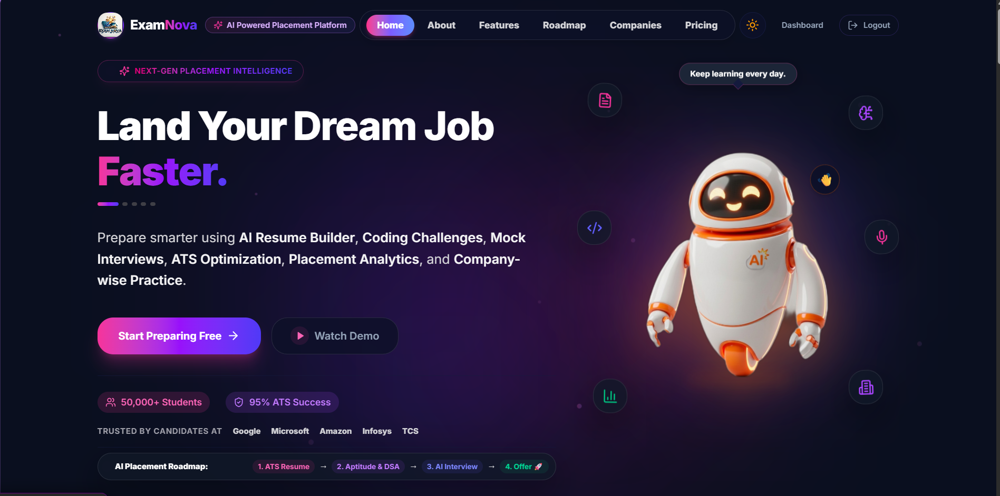

<div align="center">

# 🚀 ExamNova

### AI-Powered Placement Preparation Platform



<p>
  <strong>Crack Placements with AI-Powered Preparation</strong>
</p>

<p>
  Resume Builder • AI Interview Coach • Coding • Aptitude • Company Preparation • Analytics
</p>

</div>

---

## 🎯 About ExamNova

ExamNova is a modern AI-powered placement preparation platform designed to bring resume building, coding practice, aptitude preparation, interview preparation, company-specific preparation, analytics, and AI-powered learning into one ecosystem.

> 🔒 **Current Status:** Private Development / Personal Testing
>
> ExamNova is currently being developed and tested privately before a public release.


# 🚀 ExamNova — AI-Powered Placement Preparation Platform

> **Crack Placements with AI-Powered Preparation**

ExamNova is a modern **AI-powered placement preparation platform** designed to help students prepare for technical interviews, aptitude tests, coding assessments, resumes, and overall placement readiness — all in one place.

The platform combines **AI assistance, personalized preparation, coding practice, aptitude training, interview preparation, resume analysis, company-specific preparation, analytics, and gamification** into a single ecosystem.

> 🔒 **Current Status:** Private Development / Personal Testing
> ExamNova is currently being developed and tested privately before a public release.

---

## 🎯 Vision

ExamNova aims to provide students with a complete preparation ecosystem instead of requiring multiple platforms for different stages of placement preparation.

The goal is to help students:

* 📄 Build and improve resumes
* 🤖 Practice AI-powered interviews
* 💻 Improve coding and DSA skills
* 🧠 Prepare for aptitude tests
* 🏢 Prepare for company-specific hiring patterns
* 📊 Track preparation and performance
* 🎯 Identify weak areas
* 🏆 Earn XP, badges, and achievements
* 📈 Improve overall placement readiness

---

# ✨ Key Features

## 📄 AI Resume Builder

Create professional, ATS-friendly resumes with AI assistance.

Features include:

* Resume creation
* Resume editing
* ATS analysis
* Resume scoring
* Job Description matching
* Resume history
* PDF/DOCX resume processing
* AI-based improvement suggestions

---

## 🤖 AI Interview Coach

Practice interviews using AI-generated questions.

Supports preparation for:

* HR interviews
* Technical interviews
* Behavioral interviews
* Resume-based interviews
* Company-specific interviews

The system can analyze performance and provide feedback to help improve interview readiness.

---

## 🎤 SpeakWise AI

AI-powered interview and speaking practice module.

Planned capabilities include:

* Voice-based interview practice
* Speech analysis
* Confidence tracking
* Filler-word detection
* Interview performance reports
* AI-generated interview questions

---

## 💻 Coding & DSA Platform

Practice coding problems organized by topic and difficulty.

Topics include:

* Arrays
* Strings
* Linked Lists
* Stack
* Queue
* Trees
* Graphs
* Recursion
* Searching
* Sorting
* Hashing
* Greedy Algorithms
* Dynamic Programming
* Backtracking
* SQL

Users can practice problems based on:

* Topic
* Difficulty
* Company
* Preparation goals

---

## 🧠 Aptitude Preparation

Prepare for placement aptitude assessments through structured question banks.

### Quantitative Aptitude

* Percentage
* Profit & Loss
* Time & Work
* Time, Speed & Distance
* Probability
* Permutation & Combination
* Number System
* Ratio & Proportion
* Algebra
* Geometry

### Logical Reasoning

* Seating Arrangement
* Blood Relations
* Coding-Decoding
* Direction Sense
* Puzzles
* Syllogism

### Verbal Ability

* Reading Comprehension
* Error Detection
* Sentence Improvement
* Vocabulary
* Synonyms
* Antonyms

---

# 🏢 Company Preparation Hub

Prepare specifically for company hiring processes.

Company preparation can include:

* Aptitude
* Coding
* Technical interviews
* HR interviews
* Behavioral interviews
* Company-specific question sets

Companies targeted by the platform include:

* Amazon
* Google
* Microsoft
* TCS
* Infosys
* Wipro
* Accenture
* Capgemini
* Cognizant

---

# 📚 Question Bank Engine

ExamNova includes a centralized question management architecture designed to power multiple platform modules.

Question categories include:

* Aptitude questions
* Coding problems
* Technical interview questions
* HR questions
* Behavioral questions
* Resume-based interview questions
* Company-specific questions

### Question Workflow

```text
Draft
  ↓
Review
  ↓
Approved
  ↓
Published
```

The architecture is designed to support:

* Question CRUD
* Difficulty classification
* Topic classification
* Company tagging
* Bulk import
* AI question generation
* Question approval
* Performance analytics

---

# 🤖 AI Question Generator

Administrators can generate questions using AI based on parameters such as:

* Topic
* Subtopic
* Difficulty
* Company
* Number of questions

Generated content can include:

* Questions
* Options
* Answers
* Explanations
* Difficulty mapping
* Company tags

AI-generated questions can then go through an approval workflow before publication.

---

# 📊 Placement Analytics

ExamNova tracks preparation progress and performance.

Analytics can include:

* Coding performance
* Aptitude accuracy
* Question attempts
* Correct/wrong answers
* Topic accuracy
* Company readiness
* Interview readiness
* Skill improvement
* Learning progress

The goal is to provide students with a clear understanding of:

> **Where am I currently strong, and what should I improve next?**

---

# 🎮 Gamification

ExamNova uses gamification to make preparation more engaging.

Possible rewards include:

* XP
* Badges
* Achievements
* Streaks
* Topic mastery
* Challenge completion

Example:

```text
🔥 7 Day Streak
🏆 DSA Beginner
⚡ 500 XP
🎯 Arrays Mastery — 82%
```

---

# 🎓 Learning Marketplace & Opportunity Hub

The platform is also designed to provide learning and growth opportunities.

Students can discover:

* Learning resources
* Coding challenges
* Hackathons
* Study groups
* Learning events
* Skill-building opportunities

AI can recommend opportunities based on:

* Skills
* Coding performance
* Aptitude performance
* Weak topics
* Learning history
* Interview readiness

Example:

```text
Dynamic Programming Challenge
95% Recommended

Full Stack Development Study Group
90% Recommended

AI Hackathon
88% Recommended
```

---

# 📈 Progress Tracking

Students can track their preparation journey through:

```text
Not Started
     ↓
In Progress
     ↓
Completed
```

Progress can include:

* Challenges completed
* Resources completed
* Hackathons joined
* Study sessions
* XP earned
* Learning streak
* Skill growth

---

# 🔐 Security

Security is an important part of the platform architecture.

ExamNova uses:

* Supabase Authentication
* Google OAuth
* Role-based access control
* Row Level Security (RLS)
* Server-side authorization
* Protected admin functionality
* MFA support
* Secure file uploads
* API validation
* Rate limiting
* Security headers
* Server-side AI API integration

Sensitive API keys are kept server-side and are not exposed to the client.

---

# 🛠️ Tech Stack

### Frontend

* Next.js
* React
* TypeScript
* Tailwind CSS

### Backend

* Next.js API Routes
* Supabase

### Database

* PostgreSQL
* Supabase

### Authentication

* Supabase Auth
* Google OAuth
* MFA / TOTP

### AI

* Google Gemini API

### Deployment

* Vercel

### Development

* Git
* GitHub
* Antigravity / AI-assisted development tools

---

# 🏗️ High-Level Architecture

```text
                    ┌──────────────────────┐
                    │      ExamNova        │
                    │   Next.js Frontend   │
                    └──────────┬───────────┘
                               │
             ┌─────────────────┼─────────────────┐
             │                 │                 │
             ▼                 ▼                 ▼
       ┌───────────┐     ┌───────────┐     ┌───────────┐
       │ Supabase  │     │  Gemini   │     │ Analytics │
       │   Auth    │     │    AI     │     │  Engine   │
       └─────┬─────┘     └───────────┘     └───────────┘
             │
             ▼
       ┌───────────────┐
       │ PostgreSQL DB │
       └───────┬───────┘
               │
     ┌─────────┼──────────┐
     ▼         ▼          ▼
 Question   Resume     User Progress
   Bank     System       & Analytics
```

---

# 📁 Major Platform Modules

```text
ExamNova
│
├── AI Resume Builder
├── Resume Analyzer
├── JD Matcher
├── AI Interview Coach
├── SpeakWise AI
├── Coding & DSA
├── Aptitude
├── Company Preparation Hub
├── Question Bank
├── Mock Placement
├── Placement Analytics
├── Gamification
├── Learning Marketplace
├── Study Groups
├── Hackathons
├── Learning Events
└── Admin Dashboard
```

---

# 👥 User Roles

## 👨‍🎓 Student

Students can:

* Build resumes
* Practice coding
* Solve aptitude questions
* Prepare for companies
* Practice interviews
* Track performance
* Earn achievements
* Discover learning opportunities

## 👨‍🏫 Mentor

Mentors can manage learning content such as:

* Learning resources
* Coding challenges
* Hackathons
* Study groups
* Learning events

## 🛡️ Admin

Administrators can manage:

* Question banks
* Users
* Mentors
* Content
* Question approval
* Company mappings
* Platform activities
* AI-generated content

---

# 🔒 Private Development Status

ExamNova is currently **not intended for public users**.

The project is being actively developed and tested to improve:

* Features
* UI/UX
* AI functionality
* Security
* Database architecture
* Performance
* Authentication
* Deployment reliability

The current deployment environment is primarily for **personal testing and development validation**.

---

# 🗺️ Development Roadmap

### ✅ Completed / In Development

* [x] Next.js application
* [x] Supabase integration
* [x] Authentication
* [x] Google OAuth
* [x] AI Resume functionality
* [x] Coding preparation
* [x] Aptitude preparation
* [x] Company preparation architecture
* [x] Question Bank architecture
* [x] AI integration
* [x] Analytics architecture
* [x] Security hardening

### 🚧 Improving

* [ ] Advanced AI recommendations
* [ ] Advanced interview analytics
* [ ] SpeakWise AI improvements
* [ ] Adaptive learning
* [ ] Expanded question datasets
* [ ] UI/UX refinement
* [ ] Performance optimization
* [ ] Additional testing

### 🔮 Future

* [ ] Public beta
* [ ] More company-specific preparation
* [ ] Advanced AI learning paths
* [ ] Expanded learning marketplace
* [ ] More gamification
* [ ] Mobile experience improvements

---

# 🎯 Long-Term Goal

ExamNova aims to become a complete **AI-powered placement preparation ecosystem** where a student can go from:

```text
Learn
  ↓
Practice
  ↓
Analyze
  ↓
Identify Weaknesses
  ↓
Improve
  ↓
Practice Interviews
  ↓
Build Resume
  ↓
Prepare for Companies
  ↓
Track Placement Readiness
```

---

# 👨‍💻 Developer

**Shahid Raza**

AI/ML Engineering Student & Developer

Building ExamNova as a personal project focused on combining:

* AI
* Full-Stack Development
* Data & Analytics
* Education Technology
* Placement Preparation

---

# ⭐ Project Status

```text
Development:        🟡 Active
Public Release:     🔴 Not yet
Personal Testing:   🟢 Active
AI Integration:     🟢 Active
Backend:             🟢 Active
Security:            🟢 Hardened
```

> 🚀 ExamNova is continuously evolving. The current version is a private development/testing build and features may change significantly before the public release.
